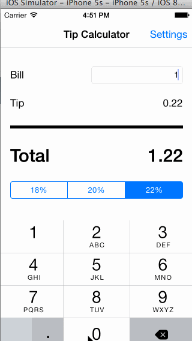

# Tip Calculator 

This is an iOS app that computes the tip for a given bill amount. The 
app supports three tip percentage values (18%, 20%, 22%). The user can
also select a default tip percentage to use (via a settings screen). 

Time spent: 6 hours in total

Completed user stories:
 * [x] Required: Tip calculator screen, where the user can enter a bill
amount and determine the tip and total amount to be paid.
 * [x] Required: Settings screen, so the user can select a default tip
percentage
 * [ ] Optional: Animate the tip calculator screen. 

Walkthrough of all user stories:

GIF created with [LiceCap](http://www.cockos.com/licecap/).

